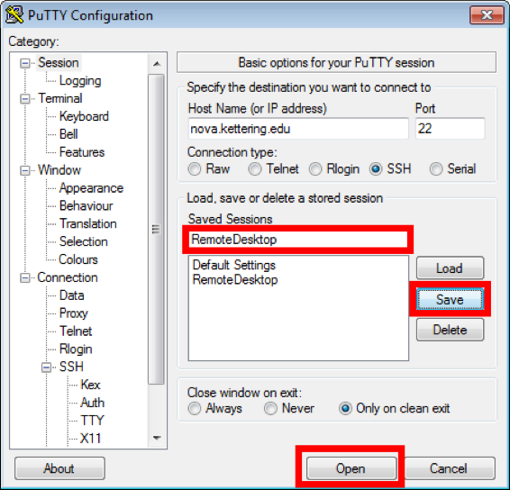

# Elastic Stack Lab03
In this lab we are going to create a mapping for the MovieLens data we downloaded in the previous lab.  

## Log into VM 
Let’s start by logging into our local VM.

### Mac 
On a Mac it’s very easy, just open the built-in Terminal and run the following. 
```
ssh ubuntu@127.0.0.1 -p2222
```


### Windows
On Windows we need to open up Putty and then connect to the session we created previously. 



## Confirm Elasticsearch is still responding. 
```
curl 127.0.0.1:9200 
```

If it is still running you should get a return like below. 
```
{
  "name" : "itdyml7",
  "cluster_name" : "elasticsearch",
  "cluster_uuid" : "lRpAt5psT1Cr-u6hS_bc2Q",
  "version" : {
    "number" : "6.2.3",
    "build_hash" : "c59ff00",
    "build_date" : "2018-03-13T10:06:29.741383Z",
    "build_snapshot" : false,
    "lucene_version" : "7.2.1",
    "minimum_wire_compatibility_version" : "5.6.0",
    "minimum_index_compatibility_version" : "5.0.0"
  },
  "tagline" : "You Know, for Search"
}
```

## Create Mapping for MovieLens data
Now we are going to create a new mapping so that Elasticsearch knows how to handle the date in the ‘Year’ field of our CSV file.

```
curl -H "Content-Type: application/json" -XPUT 127.0.0.1:9200/movies -d '
{
    "mappings": {
        "movie": {
            "properties" : {
                "year" : {"type": "date"}
           }
        }
   }
}'
```

If the mapping was created successfully Elasticsearch API will return the following acknowledgment. 

```
{"acknowledged":true,"shards_acknowledged":true,"index":"movies"}
```

Now let’s use `curl` to confirm everything looks right. 
```
curl -H "Content-Type: application/json" -XGET 127.0.0.1:9200/movies/_mapping/movie
```

Our output looks like this
```
{"movies":{"mappings":{"movie":{"properties":{"year":{"type":"date"}}}}}}
```

That’s a lot of data all jumbled together and it’s a pain to read so let’s run that command again but this time we’ll request a better formatted version. 

```
curl -H "Content-Type: application/json" -XGET 127.0.0.1:9200/movies/_mapping/movie?pretty
```

```
{
  "movies" : {
    "mappings" : {
      "movie" : {
        "properties" : {
          "year" : {
            "type" : "date"
          }
        }
      }
    }
  }
}
```

There we go now it looks much cleaner.  Remember you can add `?pretty` to any get request and it will format the data in a much nicer way.

# Lab Complete